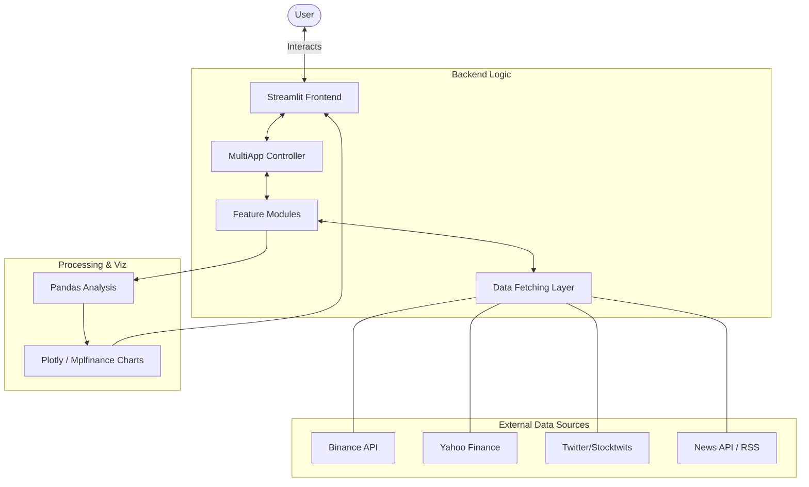
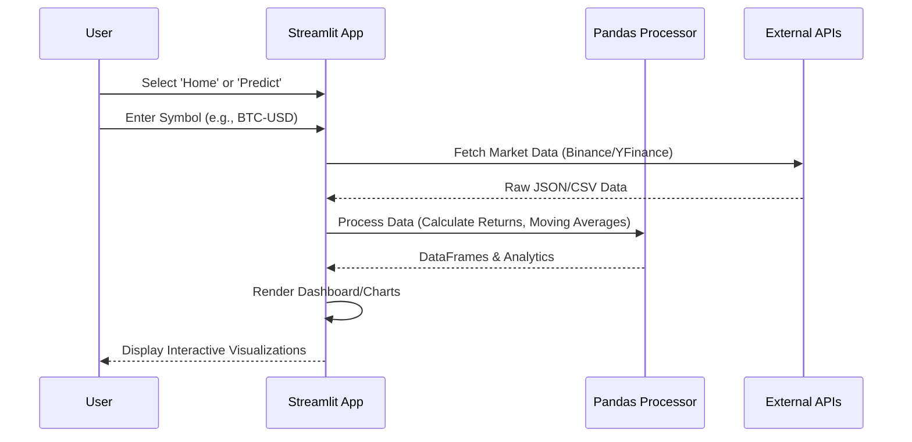

#  Cryptodab

[](https://cryptodab.streamlit.app/)
[](https://www.python.org/downloads/)
[](https://opensource.org/licenses/MIT)

**Cryptodab** is a professional-grade cryptocurrency dashboard designed for traders, analysts, and enthusiasts. It provides a centralized hub for real-time market data, technical analysis, social sentiment, and the latest industry news.

---

## 🏗️ System Architecture

The following diagram illustrates the high-level architecture of Cryptodab:



---

## 🔄 User Flow

How a user interacts with Cryptodab to analyze a specific cryptocurrency:



---

## 📸 Screenshots

|             Dashboard Overview             |               Analytics View               |              Market Trends              |
| :----------------------------------------: | :----------------------------------------: | :-------------------------------------: |
|  |  |  |

---

## 🚀 Key Features

- **💹 Real-time Price Tracking**: Live tickers and price updates directly from the Binance API.
- **📊 Comparative Analysis**: Compare annual returns and price movements across multiple assets.
- **📈 Advanced Visualizations**: Interactive candlestick charts, area charts, and bar charts using Plotly and Mplfinance.
- **🐦 Social Sentiment**: Track trending tweets and social discussions via Stocktwits and Twitter API integration.
- **📰 Market News**: Stay updated with the latest headlines filtered specifically for the crypto market.
- **📱 Responsive Design**: A clean, modern UI built with Streamlit that works across desktop and mobile browsers.

---

## 🛠️ Tech Stack

- **Frontend**: [Streamlit](https://streamlit.io/)
- **Data Analysis**: [Pandas](https://pandas.pydata.org/), [NumPy](https://numpy.org/)
- **Visualization**: [Plotly](https://plotly.com/), [Mplfinance](https://github.com/matplotlib/mplfinance)
- **APIs**:
  - [Binance API](https://binance-docs.github.io/apidocs/spot/en/) (Market Pricing)
  - [Yahoo Finance (yfinance)](https://pypi.org/project/yfinance/) (Historical Data)
  - [Tweepy](https://www.tweepy.org/) (Twitter Data)
  - [Stocktwits API](https://api.stocktwits.com/developers) (Social Sentiment)
- **Image Processing**: [Pillow](https://python-pillow.org/)

---

## ⚙️ Setup & Installation

### Prerequisites

- Python 3.8 or higher
- A Twitter Developer Account (for Social features)

### Installation Steps

1. **Clone the Repository**:

   ```bash
   git clone https://github.com/Harshstag/cryptodabv5.git
   cd cryptodabv5
   ```

2. **Create a Virtual Environment** (Recommended):

   ```bash
   python -m venv venv
   source venv/bin/activate  # On Windows: venv\Scripts\activate
   ```

3. **Install Dependencies**:

   ```bash
   pip install -r requirements.txt
   ```

4. **Configuration**:
   Open `config.py` and add your Twitter API credentials:
   ```python
   TWITTER_CONSUMER_KEY = 'your_key_here'
   TWITTER_CONSUMER_SECRET = 'your_secret_here'
   TWITTER_ACCESS_TOKEN = 'your_token_here'
   TWITTER_ACCESS_TOKEN_SECRET = 'your_token_secret_here'
   ```

---

## 🏃 Usage

Launch the application using Streamlit:

```bash
streamlit run app.py
```

The application will be available at `http://localhost:8501`.

---

## 🤝 Credits

Created with ❤️ by:

- **Harsh Singh** ([@Harshstag](https://github.com/Harshstag))
- **Yash** ([@bigdwarf43](https://github.com/bigdwarf43))

---

## 📜 License

This project is licensed under the MIT License - see the [LICENSE](LICENSE) file for details.

---

> [!NOTE]
> **Disclaimer**: Crypto products and NFTs are unregulated and can be highly risky. There may be no regulatory recourse for any loss from such transactions. Always do your own research.
